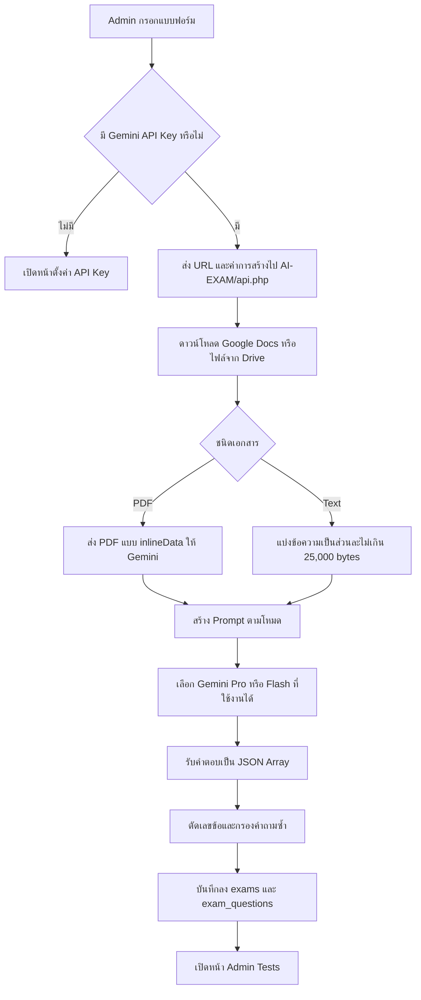

# English Exam Generation Logic

เอกสารนี้สรุป Logic ปัจจุบันของหน้า `admin/ai-exam` สำหรับการสร้างข้อสอบภาษาอังกฤษจากเอกสารด้วย Gemini โดยอ้างอิงพฤติกรรมจริงในโค้ด ณ วันที่จัดทำเอกสาร

## ไฟล์ที่เกี่ยวข้อง

| ส่วน | ไฟล์ | หน้าที่ |
|---|---|---|
| หน้า Admin | `admin/ai-exam.php` | โหลด layout ของ Admin และ include หน้าสร้างข้อสอบ |
| ฟอร์ม | `AI-EXAM/index.php` | รับวิชา รูปแบบ จำนวนข้อ รายละเอียด และ Google Drive URL |
| Frontend Logic | `assets/js/admin-ai-exam.js` | ตรวจฟอร์ม เรียก API รับข้อสอบ แสดงผล และสั่งบันทึก |
| Generation API | `AI-EXAM/api.php` | อ่านเอกสาร สร้าง Prompt เรียก Gemini และจัดรูปแบบผลลัพธ์ |
| Settings API | `admin/ai-settings-api.php` | อ่านและบันทึก Gemini API Key ฝั่ง Server |
| Save API | `admin/exams-api.php` | บันทึกชุดข้อสอบและคำถามลงฐานข้อมูล |

## ภาพรวมการทำงาน



## ข้อมูลที่รับจากหน้า Admin

| ค่า | ตัวอย่าง | การใช้งานจริง |
|---|---|---|
| `subject` | ภาษาอังกฤษ | ใช้ตั้งชื่อและ metadata ตอนบันทึกข้อสอบ |
| `type` | `copy`, `similar`, `levels` | เลือก Prompt และอุณหภูมิของโมเดล |
| `count` | 10 | จำนวนข้อที่ต้องการในโหมดปกติ |
| `counts` | easy 2, medium 5, hard 3 | จำนวนข้อแยกตามระดับในโหมด `levels` |
| `details` | เน้น Grammar และ Reading | ต่อท้าย Prompt เป็นเงื่อนไขเพิ่มเติม |
| `shuffle` | true/false | สลับลำดับคำถามหลังสร้างเสร็จ |
| `url` | Google Drive URL | แหล่งเอกสารต้นฉบับ |
| `useServerKey` | true | ให้ API อ่าน Gemini API Key จากฐานข้อมูล |

ข้อสังเกต: หน้าเดิมไม่ได้ส่ง `subject` เข้า Generation API ดังนั้นการเลือกวิชา "ภาษาอังกฤษ" ยังไม่บังคับให้ Gemini สร้างคำถามภาษาอังกฤษโดยตรง ภาษาและรูปแบบของข้อสอบขึ้นกับเอกสารต้นฉบับและข้อความใน `details` เป็นหลัก

## รูปแบบการสร้าง

### 1. Copy

ใช้สำหรับถอดข้อสอบจากต้นฉบับ โดยกำหนดให้คัดลอกคำถามตามเอกสารและไม่สลับลำดับ

- PDF: ให้ Gemini อ่าน PDF และสกัดข้อสอบตามจำนวนที่กำหนด
- Text: ส่งข้อความแต่ละส่วนให้ Gemini แล้วให้สกัดข้อสอบจากส่วนนั้น
- Temperature: `0.1` เพื่อลดการดัดแปลงเนื้อหา

แนว Prompt:

```text
อ่านเอกสารที่แนบมา สกัดข้อสอบจำนวน {count} ข้อ
คัดลอกให้เหมือนต้นฉบับและห้ามสลับลำดับ
```

### 2. Similar

ใช้สำหรับวิเคราะห์ต้นฉบับแล้วสร้างข้อสอบชุดใหม่ที่มีรูปแบบและความยากใกล้เคียงกัน

- นำ `details` ต่อท้ายเป็นเงื่อนไขเพิ่มเติม
- Temperature: `0.7` เพื่อให้สร้างโจทย์ใหม่ได้หลากหลาย

แนว Prompt:

```text
อ่านและวิเคราะห์เนื้อหากับแนวข้อสอบจากเอกสาร
สร้างข้อสอบใหม่จำนวน {count} ข้อที่มีความยากและรูปแบบคล้ายต้นฉบับ
เงื่อนไขเพิ่มเติม: {details}
```

### 3. Levels

ใช้สำหรับสร้างข้อสอบแยกตามจำนวนของแต่ละระดับ

| ค่า | ความหมายใน Prompt |
|---|---|
| `easy` | ง่าย ถามตรงไปตรงมา |
| `medium` | ปานกลาง มีการวิเคราะห์เล็กน้อย |
| `hard` | ยาก ต้องวิเคราะห์ลึก |
| `expert` | ยากมาก ประยุกต์สูงและซับซ้อน |

ระบบเรียก Gemini แยกแต่ละระดับที่มีจำนวนมากกว่า 0 แล้วรวมคำถามกลับเป็นชุดเดียว

## กฎเฉพาะข้อสอบภาษาอังกฤษ

Prompt กลางเพิ่มข้อกำหนดต่อไปนี้ทุกโหมด โดยเน้น Reading, Conversation และ Cloze Test:

1. `questionText` ต้องมี Passage หรือ Conversation ที่จำเป็นต่อการตอบคำถาม
2. ต้องรักษาช่องว่าง `____` ใน Cloze Test และห้ามนำเฉลยของข้อก่อนหน้ามาเติมในเนื้อเรื่องของข้อถัดไป
3. ต้องมีประโยคคำถามชัดเจนต่อท้าย Passage หรือ Conversation ก่อนแสดงตัวเลือก
4. หากต้นฉบับไม่มีเฉลย ให้ Gemini เลือกคำตอบที่ถูกต้องที่สุดด้วยความรู้ของโมเดล
5. ทุกข้อต้องมี `explanation` อธิบายเหตุผลของคำตอบ
6. ห้ามใส่หมายเลขข้อไว้หน้า `questionText` เพราะระบบเพิ่มเลขข้อให้เอง

ตัวอย่างโครงสร้างที่ต้องการสำหรับ Reading:

```json
[
  {
    "questionText": "Passage or conversation...\n\nWhat is the main idea of the passage?",
    "options": [
      "A. First option",
      "B. Second option",
      "C. Third option",
      "D. Fourth option"
    ],
    "correctAnswerIndex": 1,
    "explanation": "B is correct because..."
  }
]
```

`correctAnswerIndex` ใช้เลขตำแหน่งแบบเริ่มจาก 0 ดังนั้น `0` คือ A และ `3` คือ D

## การอ่านเอกสาร

### Google Docs

1. ดึง File ID จาก `/d/{fileId}` หรือ `id={fileId}`
2. เรียก URL export เป็น Text
3. ถ้าดึงไม่ได้จึงลองดาวน์โหลดแบบ Google Drive ทั่วไป

เอกสารต้องเปิดสิทธิ์เป็น `Anyone with the link`

### PDF

- ตรวจจาก MIME type หรือ header `%PDF-`
- เข้ารหัสไฟล์เป็น Base64
- ส่งเป็น `inlineData` พร้อม MIME type `application/pdf` ให้ Gemini

### Text และ DOCX จาก AI Exam Studio

- TXT อ่านเป็นข้อความโดยตรง
- DOCX เปิดด้วย `ZipArchive` และอ่านข้อความจาก `word/document.xml`
- ข้อความยาวแบ่งเป็นส่วนละไม่เกิน 25,000 bytes
- จำนวนข้อถูกกระจายไปตามจำนวนส่วนของเอกสาร

## การเลือกโมเดลและ Retry

1. เรียก Gemini Models API เพื่อหารุ่นที่รองรับ `generateContent`
2. กรองโมเดลประเภท embedding, image, audio และโมเดลที่ไม่เหมาะกับงานออก
3. เรียงรุ่นที่มีคำว่า `pro` ก่อน แล้วตามด้วย `flash`
4. หากพบ HTTP `429`, `404`, `500` หรือ `503` ให้ลองโมเดลถัดไป
5. ถ้าไม่มีรายการโมเดล ใช้ fallback `gemini-1.5-pro` และ `gemini-1.5-flash`

## การประมวลผลผลลัพธ์

1. หา JSON ตั้งแต่ `[` ตัวแรกถึง `]` ตัวสุดท้าย
2. แปลงเป็น Array ด้วย `json_decode`
3. จำกัดจำนวนคำถามไม่ให้เกินที่ขอ
4. ตัดเลขข้อที่ Gemini อาจใส่ไว้หน้า `questionText`
5. สร้าง signature จากข้อความคำถามที่ตัดช่องว่างและเปลี่ยนเป็นตัวพิมพ์เล็ก
6. กรองคำถามที่มี signature ซ้ำออก
7. สลับลำดับคำถามเมื่อเปิด `shuffle`

การกรองคำถามซ้ำอาจทำให้จำนวนข้อสุดท้ายน้อยกว่าที่กำหนด เพราะระบบยังไม่ได้เรียก Gemini เติมข้อที่ขาด

## การบันทึกฐานข้อมูล

หน้าเดิมบันทึกข้อสอบอัตโนมัติทันทีหลังสร้างสำเร็จ

ข้อมูลชุดข้อสอบ:

- ชื่อ: `แบบทดสอบ{subject}จาก AI {วันที่}`
- วิชา: ค่าจาก `subject`
- ระดับชั้น: `ทุกระดับ`
- สถานะ: `draft`
- `is_ai_generated`: 1
- แหล่งที่มา: Google Drive URL
- โหมดสร้าง: `copy`, `similar` หรือ `levels`

ข้อมูลแต่ละคำถาม:

- `question_text`
- `passage` ถ้ามี
- `options` ในรูป JSON
- `correct_answer`
- `explanation`
- `skill` ถ้ามี
- `difficulty` ถ้ามี

เมื่อบันทึกสำเร็จ ระบบเปลี่ยนหน้าไป `admin/tests?created={examId}` หากบันทึกไม่สำเร็จ ระบบยังแสดงข้อสอบใน session เพื่อทดลองทำหรือดูเฉลยได้

## Logic ที่ควรปรับสำหรับภาษาอังกฤษโดยตรง

พฤติกรรมต่อไปนี้ยังไม่มีในหน้าเดิม และควรเพิ่มเมื่อต้องการควบคุมข้อสอบภาษาอังกฤษให้แม่นขึ้น:

1. ส่ง `subject`, ระดับชั้น, CEFR level และหัวข้อเข้า Generation API โดยตรง
2. ระบุภาษาของคำถาม ตัวเลือก และคำอธิบายให้ชัด เช่น คำถามภาษาอังกฤษและคำอธิบายภาษาไทย
3. แยกประเภทข้อสอบ Grammar, Vocabulary, Reading, Conversation และ Cloze Test
4. เก็บ Passage แยกจาก `questionText` เพื่อไม่ทำ Passage ซ้ำทุกข้อ
5. ตรวจว่าตัวเลือกมีจำนวน 4 ข้อและ `correctAnswerIndex` อยู่ในช่วงที่ถูกต้องก่อนบันทึก
6. เติมคำถามใหม่อัตโนมัติเมื่อกรองข้อซ้ำแล้วจำนวนไม่ครบ
7. กำหนดสัดส่วนทักษะ เช่น Grammar 30%, Vocabulary 20%, Reading 30%, Conversation 20%

## ตัวอย่าง Request ปัจจุบัน

```json
{
  "url": "https://drive.google.com/file/d/FILE_ID/view",
  "type": "similar",
  "count": 10,
  "counts": null,
  "details": "สร้างข้อสอบภาษาอังกฤษระดับ ม.3 เน้น Grammar และ Reading",
  "shuffle": true,
  "useServerKey": true
}
```

## ตัวอย่าง Request ที่แนะนำในอนาคต

```json
{
  "source": {
    "type": "google_drive",
    "url": "https://drive.google.com/file/d/FILE_ID/view"
  },
  "subject": "ภาษาอังกฤษ",
  "grade": "มัธยมศึกษาปีที่ 3",
  "cefrLevel": "A2-B1",
  "generationMode": "similar",
  "difficulty": "medium",
  "questionCount": 20,
  "questionLanguage": "English",
  "explanationLanguage": "Thai",
  "skillDistribution": {
    "grammar": 30,
    "vocabulary": 20,
    "reading": 30,
    "conversation": 20
  },
  "shuffle": true
}
```
